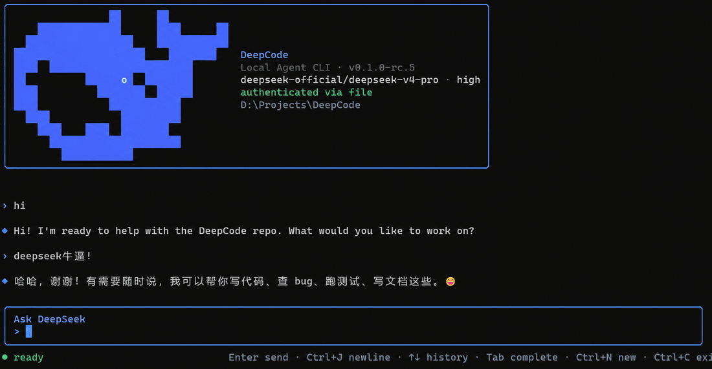

# DeepCode

English | [中文](README.zh.md)



DeepCode is a local, terminal-native coding-agent CLI built on the plugin architecture of [DeepSeek Harness](https://github.com/deepseek-ai/deepseek-harness) and [Cordis](https://github.com/cordiverse/cordis). The user-facing command is `deepseek`; the shipped profile opens the DeepCode interface directly in CMD, PowerShell, Windows Terminal, and compatible POSIX terminals.

DeepCode is in developer preview. The local CLI is the first delivery milestone; Herdr integration is deliberately deferred and does not block local use.

## Highlights

- **Professional terminal workflow** — streamed answers, multiline editing, input history, slash completion, cancellable work, session resume, model selection, masked login, approvals, and stable terminal scrollback.
- **DeepCode identity** — a preview-derived blue pixel-whale interface, a `DeepCode` console title, and one direct `deepseek` entry on every supported shell.
- **Plugin-first extension** — model providers register through `ctx.llm`, human commands through `ctx.commands`, tools through `ctx.tools`, and execution, sessions, settings, credentials, approvals, and UI adapters remain replaceable plugins.
- **Local safety** — filesystem policy, permission presets, approval routing, credential references, subprocess confinement, and durable Session logs come from the composed Harness capabilities.

## Requirements

- Node.js `^22.19` or `>=24`
- pnpm through Corepack
- A DeepSeek API key for real model requests; startup, help, configuration, and keyless snapshots do not require one

<a id="run"></a>

## Run from source

On Windows, clone or extract the repository, then run the installer once:

```cmd
git clone https://github.com/007M7/DeepCode.git
cd DeepCode
install-deepcode.cmd
```

The installer restores dependencies, builds the CLI, creates one `deepseek.cmd` entry shared by CMD and PowerShell, and adds npm's global command directory to the current user's persistent `PATH`. The direct launcher avoids recursive npm package links and works when PowerShell script execution is restricted. Keep the downloaded repository at the same location because the command points to that checkout's built entry. Open a new Command Prompt, PowerShell, or Windows Terminal window, then run:

```cmd
deepseek
```

Installation is idempotent. Run `install-deepcode.cmd` again after pulling an update; run `uninstall-deepcode.cmd` to remove the global command. Developers and POSIX users can run the source entry explicitly:

```sh
corepack pnpm install
corepack pnpm run build:lib:host
node apps/cli/lib/deepseek.js
```

The profile-launcher form remains equivalent:

```sh
dsh cli
```

## Core interaction

| Command | Purpose |
|---|---|
| `/login` | Store the selected provider's API key through the credential service. |
| `/logout` | Remove the managed credential. |
| `/models` | List every model catalog registered by installed provider plugins. |
| `/model` | Select provider, model, thinking mode, and reasoning effort. |
| `/new` | Start a fresh persisted session. |
| `/sessions` | List resumable sessions in the current workspace. |
| `/resume <id>` | Resume an eligible session. |
| `/status` | Show session, model, authentication, and workspace state. |
| `/clear` | Clear terminal scrollback and redraw the DeepCode header. |
| `/help` | Show built-in commands and every currently registered plugin command. |
| `/exit` | Flush the current session and exit. |

Enter sends; Ctrl+J or Shift+Enter inserts a newline; Up/Down navigates history or picker choices; Tab completes slash commands; Ctrl+O opens tool details; Ctrl+N starts a session; Escape or Ctrl+C cancels active work; idle Ctrl+C or empty Ctrl+D exits.

## Plugins and providers

The default preview composition installs the official DeepSeek provider. DeepCode does not hardcode future providers into its terminal loop: an adapter registered on `ctx.llm` automatically participates in `/models`, `/model`, status, authentication lookup, and Agent requests.

Install an out-of-tree bundle or plugin into the CLI profile with:

```sh
dsh plugin --profile cli add <package>
```

Registered slash commands automatically appear in completion and `/help`, including the shipped `/compact` and `/goal` commands. Profile patch layers can replace or extend tools, model providers, policies, session behavior, and command producers without modifying the Agent loop.

## Repository structure

- [`apps/cli`](apps/cli) owns the `dsh` and `deepseek` executables, profile boot, and package entry points.
- [`packages/bundle/cli-app`](packages/bundle/cli-app) owns the DeepCode terminal surface and local multi-turn driver.
- [`packages`](packages) contains the reusable Harness capabilities composed by the CLI profile.
- [`docs/architecture.md`](docs/architecture.md) documents the underlying plugin architecture and extension points.

DeepCode keeps the Harness source layout so upstream capability updates and third-party plugins remain compatible. Product identity and terminal behavior live in the CLI application layer; new capabilities attach through documented plugin APIs rather than forks of the core loop.

## Current scope and direction

The current preview preinstalls only the official DeepSeek model provider. Planned evolution includes additional provider plugins, richer Markdown and diff rendering, more tool-specific terminal presentations, stronger Windows terminal integration, and optional external orchestration such as Herdr. These are extension targets, not claims about the current release.

The interaction model is intended to approach mature coding-agent CLIs such as Claude Code while preserving DeepCode's plugin composition, durable session log, explicit approvals, and normal terminal scrollback.

## Credits and license

DeepCode is derived from DeepSeek Harness and uses vendored Cordis components. Upstream authors retain their respective copyrights. The repository is licensed under [MIT](LICENSE); third-party notices are listed in [THIRD_PARTY_NOTICES.md](THIRD_PARTY_NOTICES.md).
